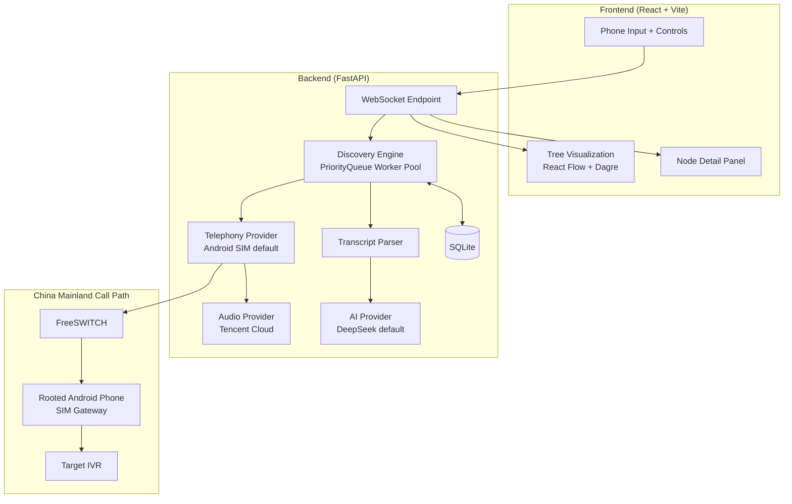
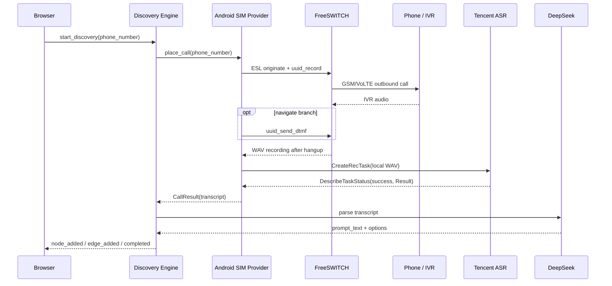
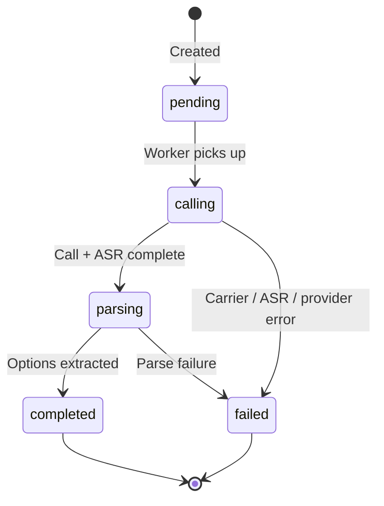
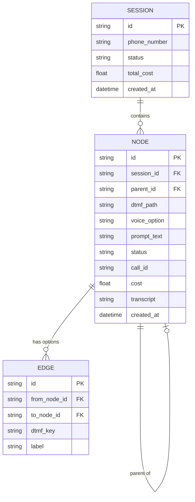

# IVR Tree Discovery — Architecture

## System Overview



The default path is `android_sim`. Bland remains selectable for the original
overseas demo, but it is not part of the China mainland baseline.

## Components

### Discovery Engine

`backend/discovery.py` owns BFS orchestration, retry policy, cycle detection and
WebSocket updates. It uses a configurable worker pool
(`MAX_CONCURRENT_CALLS`, default `1`) pulling from a depth-priority queue. The
single-SIM Android gateway cannot carry more than one cellular voice call at a
time. A node is only expanded after its transcript has been parsed.

### Telephony Provider

`backend/providers/` defines a vendor-neutral call boundary:

- `AndroidSimGatewayProvider` originates a real cellular call through FreeSWITCH
  ESL, sends `X-GSM-Destination`, records both call legs, injects DTMF and plays
  TTS prompts.
- `BlandProvider` keeps the original cloud call/ASR behavior available.

Providers advertise only the capabilities they can actually deliver. The Android
provider reports ASR/TTS as available only when Tencent credentials are present;
otherwise discovery refuses to spend a real call.

### Audio Provider

`backend/audio/` separates speech processing from telephony:

- `TencentAudioProvider.transcribe()` submits a local WAV with `CreateRecTask`
  (`SourceType=1`, `8k_zh`) and polls `DescribeTaskStatus`.
- `TencentAudioProvider.synthesize()` calls `TextToVoice` with an 8 kHz WAV
  response and writes the result to a local file for FreeSWITCH playback.
- TC3-HMAC-SHA256 signing is implemented locally with `httpx`; no Tencent SDK is
  required.

Tencent file ASR is asynchronous. The frontend may show a `calling` node while
the call is live, but the full transcript only becomes available after hangup and
ASR completion.

### AI Provider

`backend/ai/` separates transcript understanding from the model vendor:

- DeepSeek is the default OpenAI-compatible provider.
- Anthropic remains available by setting `AI_PROVIDER=anthropic`.
- `transcript_parser.py` consumes the provider boundary and owns JSON validation,
  deduplication and navigation-option filtering.

### Optimization Report

`backend/report_generator.py` reads the completed session tree, transcripts and
business context, then asks the AI Provider for a structured bilingual report.
Reports are cached in the `optimization_reports` SQLite table. Generation is
blocked while a discovery session is still running so the final recommendations
are always based on the complete tree.

## Call Lifecycle



## Node Lifecycle



## Data Model



## WebSocket Protocol

| Direction | Message | Purpose |
|-----------|---------|---------|
| Client → Server | `start_discovery` | Begin exploring a phone number |
| Client → Server | `cancel` | Stop current discovery |
| Client → Server | `rediscover_subtree` | Re-explore a node and its descendants |
| Client → Server | `ping` | Keep-alive |
| Server → Client | `node_added` | New node created |
| Server → Client | `node_updated` | Status, cost, prompt or call id changed |
| Server → Client | `edge_added` | Menu option discovered |
| Server → Client | `session_status` | Progress and provider-reported cost |
| Server → Client | `live_transcript` | Final transcript callback (file ASR is not streaming) |
| Server → Client | `subtree_cleared` | Children deleted for re-discovery |
| Server → Client | `error` | Error message |

## Edge Cases

| Scenario | Handling |
|----------|----------|
| Repeated menu | Fuzzy Jaccard fingerprinting, threshold 0.6 |
| Dead end | Mark leaf node, do not recurse |
| Busy line | Retry with backoff |
| Short/empty transcript | Retry up to three calls |
| Missing ASR configuration | Fail before dialing |
| ASR task failure | Mark the node failed without another real call |
| Call timeout | FreeSWITCH scheduled `uuid_kill` at `max_duration` |
| Voice-only IVR option | Tencent TTS → local WAV → `uuid_broadcast` |
| Server restart | `/api/recover-stuck` reconciles persisted call ids |

## File Structure

```text
backend/
├── main.py
├── discovery.py
├── transcript_parser.py
├── ai/
│   ├── base.py
│   ├── deepseek_provider.py
│   └── anthropic_provider.py
├── audio/
│   ├── base.py
│   └── tencent_provider.py
├── providers/
│   ├── base.py
│   ├── android_sim_provider.py
│   ├── bland_provider.py
│   └── esl.py
├── database.py
├── models.py
└── tests/
```

## Tech Stack

- Backend: Python 3.12+, FastAPI, asyncio, `httpx`, `aiosqlite`
- Frontend: React 18, TypeScript, Vite, React Flow, Dagre
- AI: DeepSeek default, Anthropic optional
- Audio: Tencent Cloud `8k_zh` ASR and `TextToVoice` TTS
- Telephony: Homebrew FreeSWITCH + rooted Android SIM gateway
- Storage: SQLite
